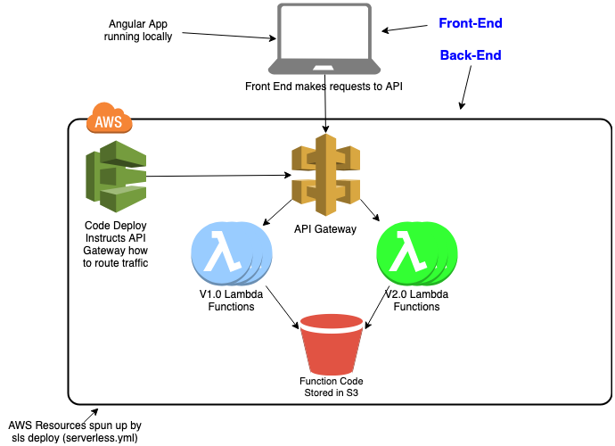

# serverless-deployment-demo
Demonstrates how to use Linear and Canary deployments in an AWS Serverless environment

There are two core parts to this project:
1. back-end
2. front-end

See the respective directories for the specifics

    .
    ├── back-end/       # The code for the serverless API
    ├── documentation/  # Images/Diagrams
    ├── front-end/      # The Angular App that demonstrates live traffic migration
    └── README.md

## About the Project
* Written using dotnetcore (C#) for the back-end
* Written in Angular for the front-end

This project creates:
* A API backend (unauthenticated)
* A single-page web application that requests responses from the API
    This demonstrates (live) how the deployment is actually running

**To Get Started, check out the Front-End and Back-End folders**

## Overview

